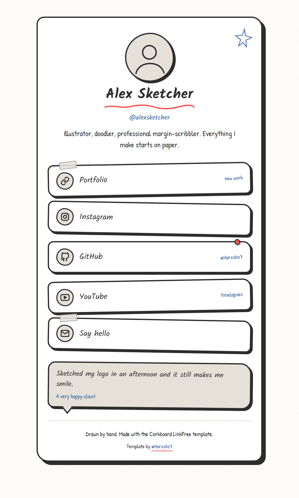

# Corkboard

A hand-drawn, sketchbook-style LinkFree template: wobbly ink borders, hard offset
shadows that press flat on click, a scattering of taped and thumbtacked link cards,
Kalam + Patrick Hand lettering, and just enough paper grain to feel like a real page.

Nothing is loaded from a CDN except the two Google Fonts, so it works offline and
opens straight from disk with `file://`.

Made by [@Harxshz7](https://github.com/Harxshz7).

## Preview



A real render of the default `config.js`, captured at a 720x1200 viewport (so the
whole page fits, including the tape, thumbtacks and doodle). If you change the
content, replace `preview.png` with a fresh screenshot of your own version.

## Getting started

1. Copy this whole `Corkboard` folder wherever you want to keep your page.
2. Open `index.html` in a browser to see it — no server needed.
3. Edit `config.js` (see below). That is the only file you need to touch.
4. Replace `preview.png` with a screenshot of your own version if you are
   contributing this back upstream — the gallery shows it next to the name.

## Customizing

Everything — name, bio, avatar, links, testimonials, footer — lives in
`config.js` as a single object:

```js
window.LINKFREE_CONFIG = {
  pageTitle: "Your Name - Links",
  pageDescription: "One line about you, used as the meta description.",
  name: "Your Name",
  handle: "@yourhandle",
  bio: "A short bio.",
  avatar: "me.jpg",
  links: [
    { label: "Instagram", url: "https://instagram.com/you", icon: "instagram", note: "" }
  ],
  testimonials: [
    { quote: "They were great.", author: "A client" }
  ],
  footerText: "Made with the Corkboard template."
};
```

### Why `config.js` and not `data.json`?

Because most people open `index.html` directly from their file system. Browsers
block `fetch()` against a local `.json` file on `file://` URLs (CORS), but they do
not block a `<script src="config.js">`. Loading the config as a script keeps the
content separate from the markup without requiring a local web server.

### Adding a link

Append an object to the `links` array:

```js
{ label: "My shop", url: "https://example.com/shop", icon: "link", note: "new" }
```

- `label` — the text on the card.
- `url` — where it points. External links open in a new tab automatically.
- `icon` — one of the built-in hand-drawn icons: `github`, `twitter`, `instagram`,
  `linkedin`, `youtube`, `mail`, `link`. Or pass any image path/URL (e.g. `"me.png"`)
  and it will be shown instead.
- `note` — optional small scribble on the right of the card. Leave it as `""` for none.

Tape and thumbtacks are applied automatically and cycle down the list. To remove the
testimonial block entirely, set `testimonials: []` — the section hides itself.

### Changing the look

Colors, fonts, and the wobble are all at the top of `style.css` under `:root`.
The wobble comes from multi-value `border-radius` declarations and the slight
`rotate()` on each card — if you flatten those, it stops looking hand-drawn.

## Accessibility notes

- Every interactive element keeps a visible `:focus-visible` ring (blue, 3px).
- Decorative elements are `aria-hidden` and hidden entirely below 640px.
- `prefers-reduced-motion` disables the jiggle and transitions.
